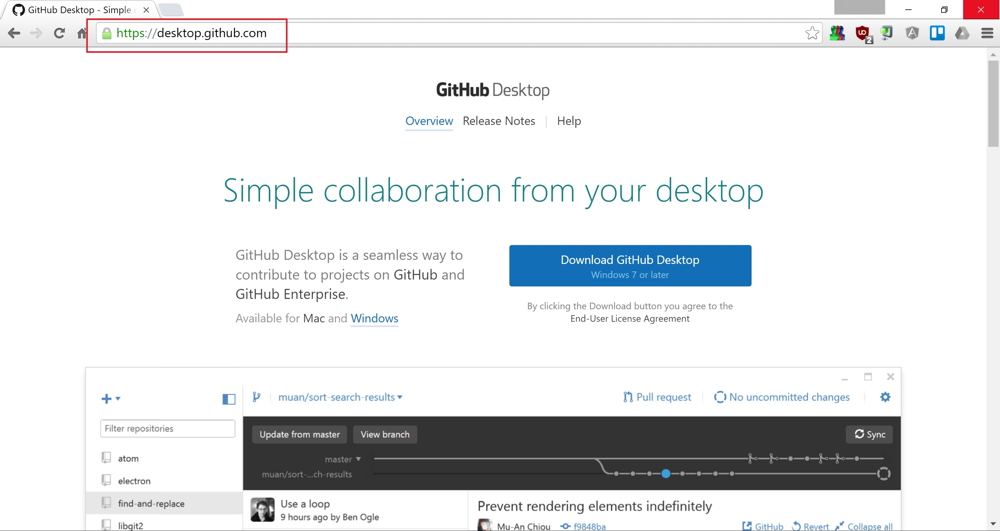
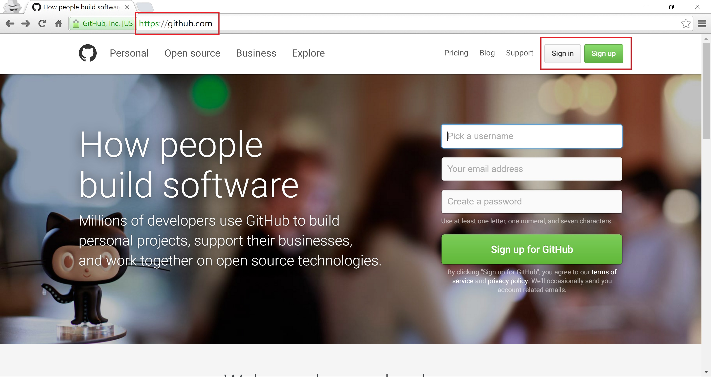
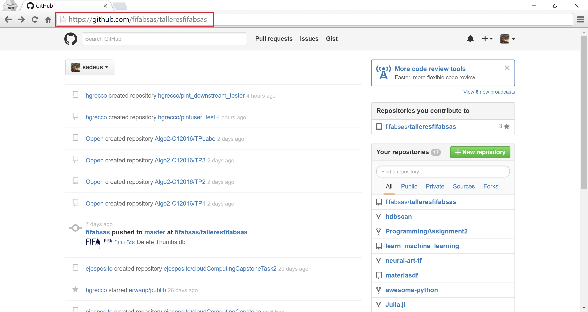
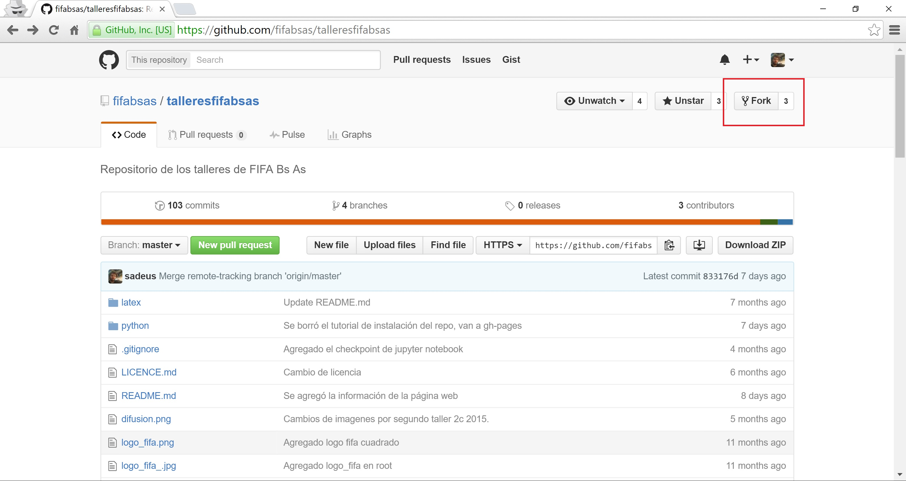
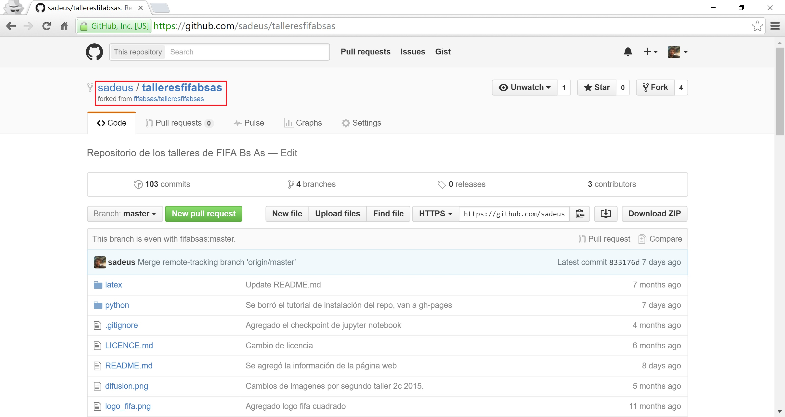
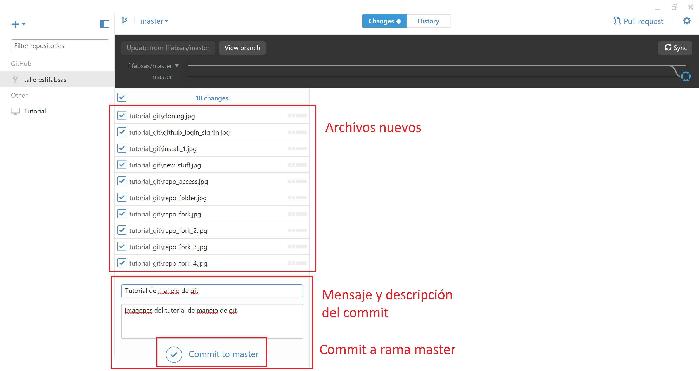
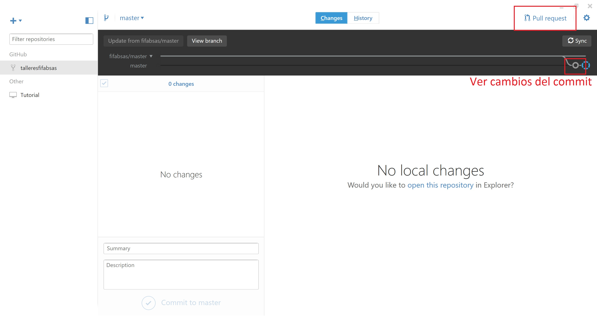
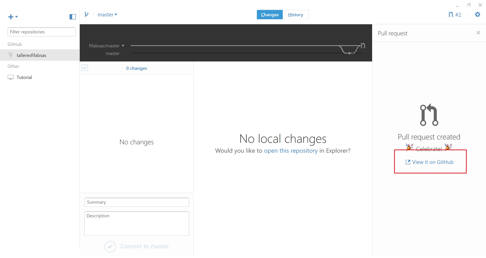
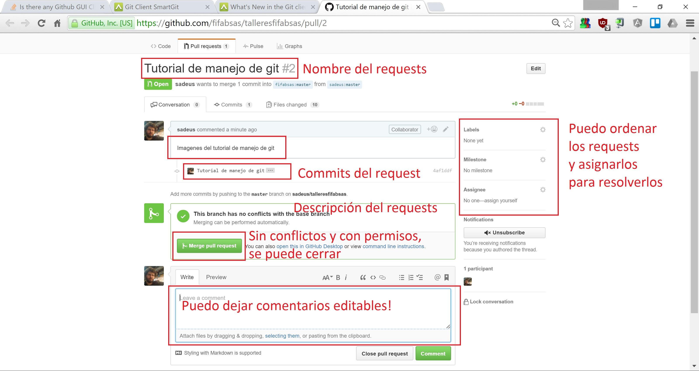

# Tutorial de manejo de repositorio en Github

## Inicialización
1. Primero instalar la aplicación Desktop de Github. Se descarga [acá](http://desktop.github.com)

2. Segundo registrarse en Github

3. Ir al repositorio en http://github.com/fifabsas/talleresfifabsas

4. Forkear el repositorio, es decir hacerse una copia del repositorio en tu cuenta

5. En la aplicación de Github de escritorio, clonar el repositorio recién forkeado.

Hecho esto ya estás listo para trabajar

## Pull requests y branches
Los pull requests permiten que vos trabajes en tu copia del repositorio, y después le pidas al administrador del repositorio padre que adose los cambios que efectuaste vos, en alguna rama o *branches* del repositorio. Nosotros como no tenemos mucha complejidad tenemos solo dos ramas: **master** (donde va todo el código) y **gh-pages** (dónde va todo lo de la página web). 

Hecho el trabajo en la rama que corresponda (es decir, cambiados los archivos en la carpeta del repositorio), en la aplicación del Github hacemos lo siguiente
1. Commiteamos, es decir subirlo a Github, el trabajo. La regla es commitear seguido, commitear poco y ser descriptivo en lo commiteado.

2. Creamos un pull requests y comparamos con la rama del repositorio original padre

3. Finalmente, en la página del pull requests del repositorio padre se puede comentar detalles de los cambios, hacer seguimiento, y cerrarlo al repositorio padre
